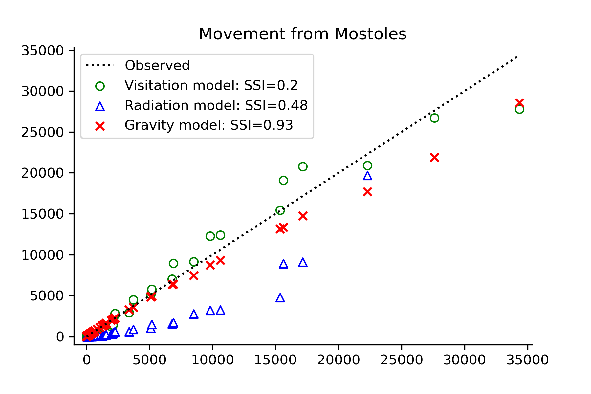
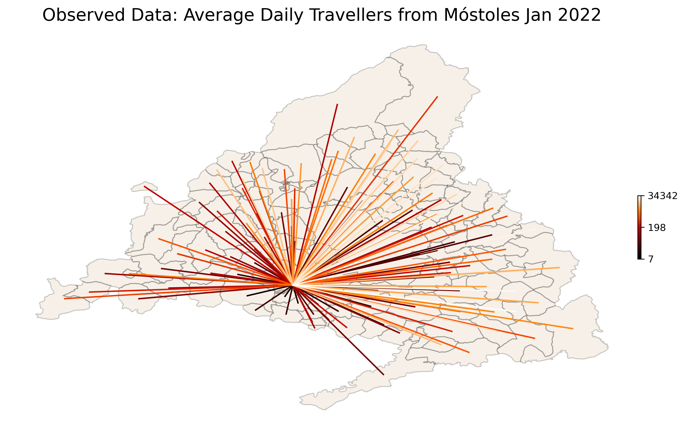
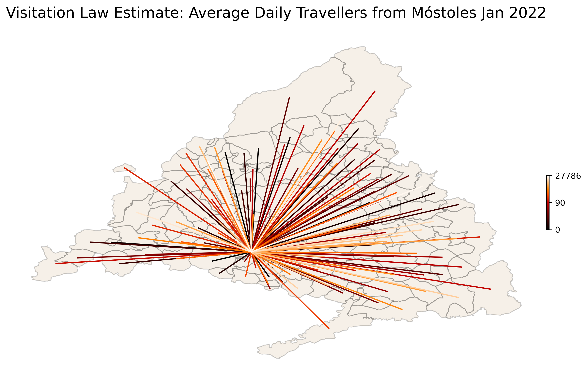
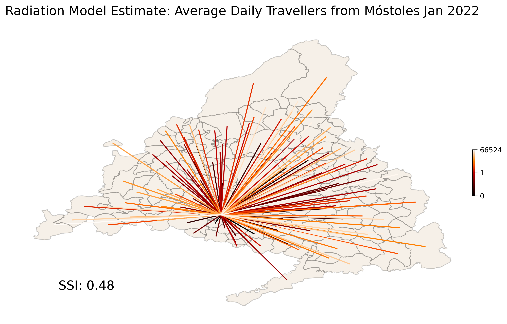
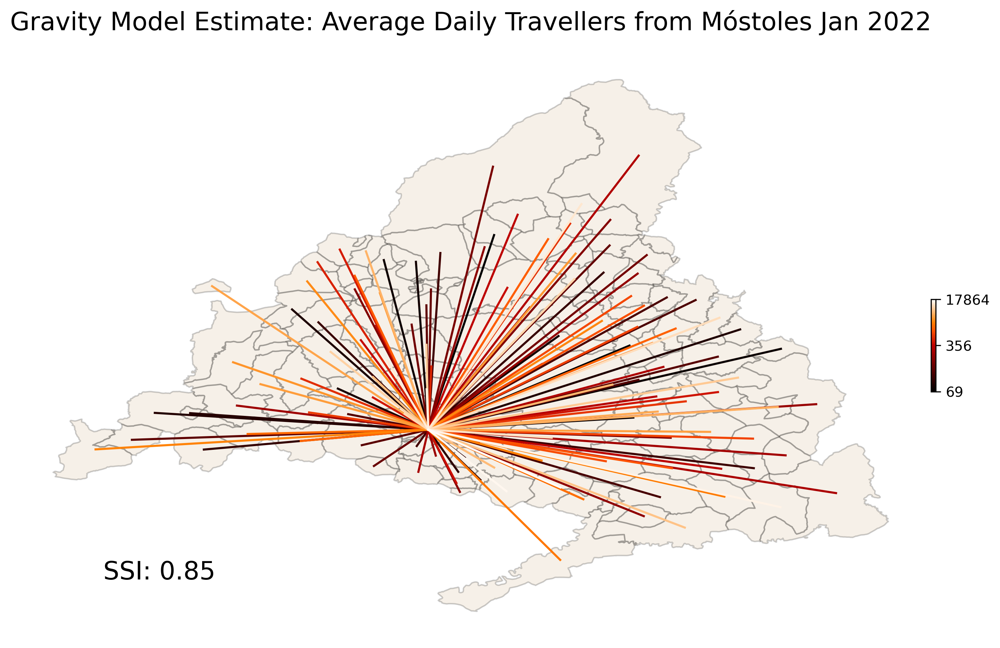

<h1> Mobility Models Applied to Mobile Data from Madrid 2022 </h1>

	The present analysis compares Visitation Law, Radiation, and Gravity models using mobile phone data from Spain. Only data from Madrid is used, where movement across 119 municipios (neighbourhoods/councils) over the period of a month (January 2022, 31 days) was recorded in the form of number of visits from an origin to a location. Data was averaged over the whole month for analysis and only travellers from home destination were kept (i.e people travelling from residence municpio to any other municipio).

<h1> Models </h1>
<h2>Visitation Model</h2>

 According to the visitation law of human mobility the number of unique locations visited by an individual is proportional to the square root of the total number of visits they make (Schläpfer et al., 2021). Thus the magnitude of a flow of visitors given a distance <i>r</i> and a frequency of visitation <i>f</i> can be approximated as: <i>&mu;</i> = <i>&rho;</i>(<i>rf</i>)2 , where <i>r</i> = distance between origin and destination, <i>f</i> = once per day and the "spectral flow" <i>&rho;</i> =  <i>N/A</i>, where <i>N</i> are the visitors counts and <i>A</i> = <i>2&pi;r&delta;r</i>, the area of displacement where we assume (for present analysis) the incremental distance <i>&delta;r</i> = 1km. So, the average number of visitors per day can be estimated as: 

 <i>V</i> = <i>&mu;A</i>/<i>r2ln(fmax/fmin)</i>

Presently we use the entire matrix of areas <i>A</i>, slightly abusing notation <i>A</i> = <i>Aij</i> . We use the entire matrix of magnitudes <i>&mu;</i> and radi <i>r</i> in the same manner. Where <i>fmin = F/N/31</i>, and <i>fmax = F/N</i>, where <i>F</i> is the average number of visits from origin to location over 1 month and <i>N</i> is the average number of visitors over the same month. That is, <i>fmin</i> indicates the average minimum frequency of visitation per person during a month and <i>fmax</i> the maximum.

<h2>Radiation Model</h2>

 The Radiation Model is parameter-free and estimates the number of visitors from one location (i.e. municipio) to another (Simini et al., 2013). The model assumes movement from origin to location as arising from a Binomial process, this with mean (i.e. estimate) <i>pTi</i> and variance <i>pTi(1 - p)</i>, where <i>Ti</i> is the estimated total number of commuters from origin <i>i</i>, such as <i>Ti = Mi(Nc / N)</i>, where <i>Nc</i> is the total number of visitors, <i>N</i> the total population of Madrid, and <i>Mi</i> are the populations at the origins (i.e. populations of municipios), equivalent to the populations at the destinations <i>Nj</i> (i.e. each municipio is origin to another and destination from another municipio). Then the model is defined as:

 <i>E(Tij) = TiMiNj / (Mi + Sij)(Mii + Nj + Sij)</i> 

Where <i>Sij</i> corresponds to the matrix containing the populations surrounding the origin within a radius <i>Rij</i> which is equivalent to the distance between origin and destination.

<h2>Gravity Model</h2>
Finally, we run a Gravity model over the vector of travellers from Mostoles (example municipio) to the each municipio (119 including Mostoles). We used a Normalised Power Law Gravity Model (e.g. see Simini et al, 2021). The model is sampled via a Negative Binomial distribution, as it may be better for over-dispersed data, especially as it has distinct parameters for mean and variance (more relevant to appropriately capture uncertainty).

 
 &sigma;&theta;, &sigma;&omega;, &sigma;&gamma; ~ Exponential(3)

 
 &theta;m ~ HalfNormal(&sigma;&theta;)

 
 &omega;m ~ HalfNormal(&sigma;&omega;)

 
 &gamma;m ~ HalfNormal(&sigma;&gamma;)

 &lambda; = &theta;mMi(Nj&omega;mD-&gamma;m /  &sum;Nj&omega;mD-&gamma;m)

 &sigma; ~ Exponential(50) 

 ym ~ NegativeBinomial(&lambda;, &sigma;) 

Where sub-index m = [1...119] municpios, D = distance matrix from municpio to municipio, Mi = population at origins, and Nj = populations at destinations. The model sampled well with R^ ~ 1 and effective sample sizes over 500 for all parameters.

<h1> Results </h1>

 Results indicate that the Visitation Model outperforms the other models and the Gravity Models outperforms the Radiation Model according to an similarity index (SSI) metric (Schläpfer et al., 2021), defined as <i>SSI = 2&sum;ijmin(E,O)/(&sum;ijE + &sum;ijO)</i>, where <i>E</i> is the estimated average number of visitors and <i>O</i> is the observed average number of visitors.

	

	

	

	

	

<h1> Conclusion </h1>

 The Gravity and Visitation models perform much better than the Radiation model. However, the Gravity Model tends to underperform at large values, while the Visitation Model slightly underperforms at low values. More exploration of metrics and approximations may be required to better assess the models. The Gravity model may offer more leeway as its parametric form may be optimised by parameter adjustment, prior predictive checks and other techniques. Nevertheless, it is possible to explore parametric forms of the Visitation Model as well, which may outperform the other models in the long run.   

<H1> References </H1>

Schläpfer, M., Dong, L., O’Keeffe, K. et al. The universal visitation law of human mobility. Nature 593, 522–527 (2021). https://doi.org/10.1038/s41586-021-03480-9 

Simini, F., González, M., Maritan, A. et al. A universal model for mobility and migration patterns. Nature 484, 96–100 (2012). https://doi.org/10.1038/nature10856 

Simini, F., Barlacchi, G., Luca, M. et al. A Deep Gravity model for mobility flows generation. Nat Commun 12, 6576 (2021). https://doi.org/10.1038/s41467-021-26752-4

