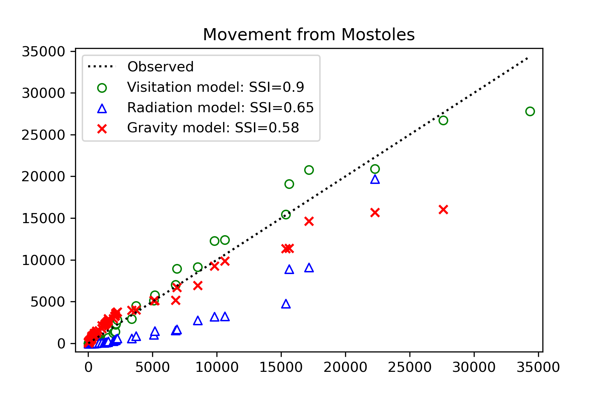
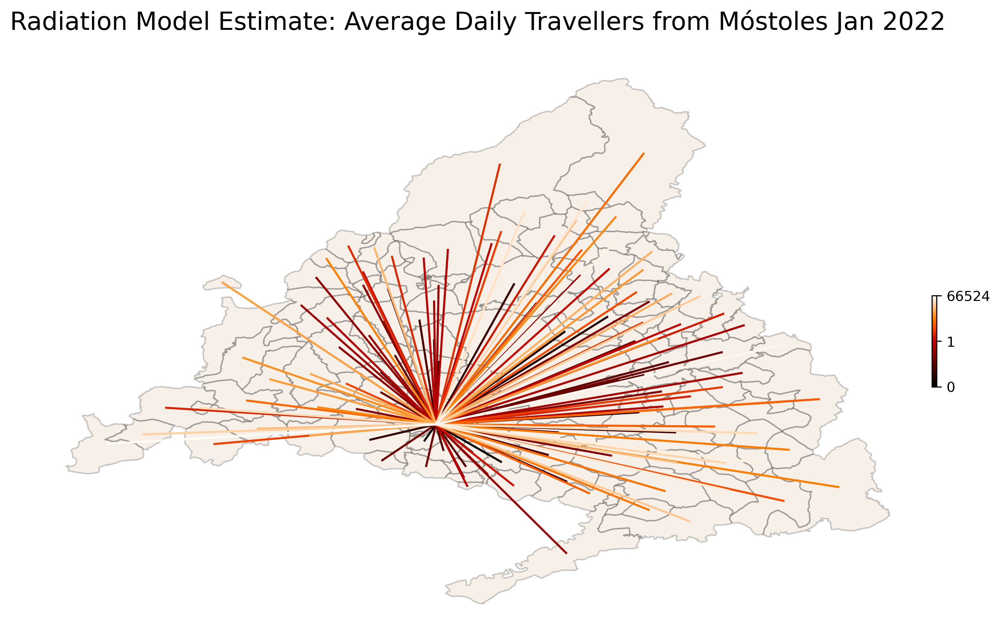
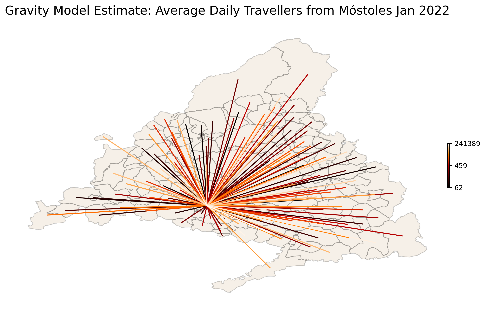
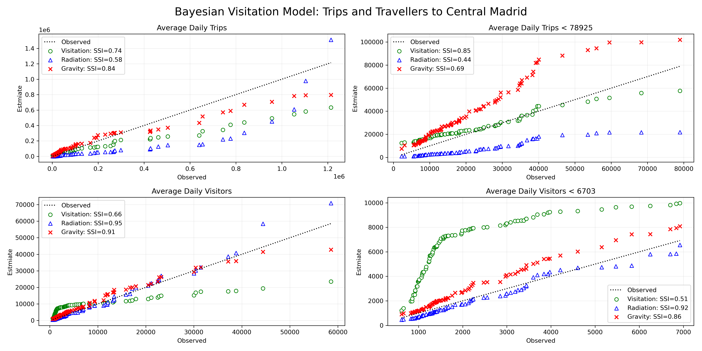
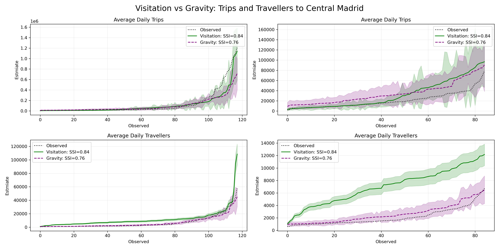

<h1> Mobility Models Applied to Mobile Data from Madrid 2022 </h1>

	The present analysis compares Visitation Law, Radiation, and Gravity models using mobile phone data from Spain. Only data from Madrid is used, where movement across 119 municipios (neighbourhoods/councils) over the period of a month (January 2022, 31 days) was recorded in the form of number of visits from an origin to a location. Data was averaged over the whole month for analysis and only travellers from home destination were kept (i.e people travelling from residence municpio to any other municipio).

<h1> Models 1 </h1>

<h2>Visitation Model</h2>

 According to the visitation law of human mobility the number of unique locations visited by an individual is proportional to the square root of the total number of visits they make (Schläpfer et al., 2021). Thus the magnitude of a flow of visitors given a distance <i>r</i> and a frequency of visitation <i>f</i> can be approximated as: <i>&mu;</i> = <i>&rho;</i>(<i>rf</i>)2 , where <i>r</i> = distance between origin and destination, <i>f</i> = once per day and the "spectral flow" <i>&rho;</i> =  <i>N/A</i>, where <i>N</i> are the visitors counts and <i>A</i> = <i>2&pi;r&delta;r</i>, the area of displacement where we assume (for present analysis) the incremental distance <i>&delta;r</i> = 1km. So, the average number of visitors per day can be estimated as: 

 <i>V</i> = <i>&mu;A</i>/<i>r2ln(fmax/fmin)</i>

Presently we use the entire matrix of areas <i>A</i>, slightly abusing notation <i>A</i> = <i>Aij</i> . We use the entire matrix of magnitudes <i>&mu;</i> and radi <i>r</i> in the same manner. Where <i>fmin = F/N/31</i>, and <i>fmax = F/N</i>, where <i>F</i> is the average number of visits from origin to location over 1 month and <i>N</i> is the average number of visitors over the same month. That is, <i>fmin</i> indicates the average minimum frequency of visitation per person during a month and <i>fmax</i> the maximum.

<h2>Radiation Model</h2>

 The Radiation Model is parameter-free and estimates the number of visitors from one location (i.e. municipio) to another (Simini et al., 2013). The model assumes movement from origin to location as arising from a Binomial process, this with mean (i.e. estimate) <i>pTi</i> and variance <i>pTi(1 - p)</i>, where <i>Ti</i> is the estimated total number of commuters from origin <i>i</i>, such as <i>Ti = Mi(Nc / N)</i>, where <i>Nc</i> is the total number of visitors, <i>N</i> the total population of Madrid, and <i>Mi</i> are the populations at the origins (i.e. populations of municipios), equivalent to the populations at the destinations <i>Nj</i> (i.e. each municipio is origin to another and destination from another municipio). Then the model is defined as:

 <i>E(Tij) = TiMiNj / (Mi + Sij)(Mii + Nj + Sij)</i> 

Where <i>Sij</i> corresponds to the matrix containing the populations surrounding the origin within a radius <i>Rij</i> which is equivalent to the distance between origin and destination.

<h2>Bayesian Gravity Model</h2>
Finally, we run a Gravity model over the vector of travellers from Mostoles (example municipio) to the each municipio (119 including Mostoles). We used a Normalised Power Law Gravity Model (e.g. see Simini et al, 2021). The model is sampled via a Negative Binomial distribution, as it may be better for over-dispersed data, especially as it has distinct parameters for mean and variance (more relevant to appropriately capture uncertainty).

 <i>&theta;</i> ~ Gamma(0.01, 0.01)

 <i>&omega;</i> ~ HalfNormal(2)

 <i>&sigma;&gamma;</i>  ~ HalfNormal(0.25)

 <i>&gamma;i</i> ~ HalfNormal(&sigma;&gamma;)

 <i>&lambda;</i> = <i>&theta;mMi(Nj&omega;mrij-&gamma;m /  &sum;Nj&omega;mrij-&gamma;m)</i>

 <i>&sigma;</i> ~ Exponential(5) 

 <i>ym</i> ~ NegativeBinomial(<i>&lambda;, &sigma;</i>) 

Where sub-index <i>m</i> = [1...119] municpios, <i>rij</i> = distance vector from origin municpio <i>i</i> to destination municipio <i>j</i>, <i>Mi</i> = population at origins, and <i>Nj</i> = populations at destinations. The model sampled well with <i>R^</i> ~ 1 and effective sample sizes over 500 for all parameters.

<h1> Results 1 </h1>

 Results indicate that the Visitation Model outperforms the other models and the Gravity Models outperforms the Radiation Model according to an similarity index (SSI) metric (Schläpfer et al., 2021), defined as <i>SSI = 2&sum;ijmin(E,O)/(&sum;ijE + &sum;ijO)</i>, where <i>E</i> is the estimated average number of visitors and <i>O</i> is the observed average number of visitors.

	

	

	

	

	

<h1> Models 2 </h1>

Although both Visitation and Radiation models have a parameter free structure, some of the variables in the models need to be approximated. In particular <i>Ti</i> in the Radiation Model and <i>&mu;j</i> in the Visitation Model. We explore parametric version of all thre models for the estimation of, in this case, inflow of number visitors and trips towards central Madrid.

<h2>Bayesian Visitation Model</h2>

The visitation model can include two addicional parameters for maximum and minimum frequencies <i>fmax</i> and <i>fmin</i> .  

 <i>&mu;j</i> ~ Wald(50, 10) 

 <i>fmax</i>  ~ Uniform(0.1, 1) 

 <i>fmax</i>  ~ Uniform(1, 100) 

 <i>vij</i>  = <i>&mu;j</i></i><i>Ai / ln(<i>fmax</i> / <i>fmin)rij2</i></i> 

 <i>&alpha;&gamma;</i>  ~ HalfNormal(0.1)

 <i>yi</i> ~ NegativeBinomial(<i>&lambda;, &alpha;</i>) 

 For the present case we use the simplest form, assigning uniform priors constrained to the range of meaningful magnitudes for each frequency parameter. For the flow magnitude it is possible to assign a continuous distributions constrained to positive values such as a Wald (Inverse Gaussian) distribution. The advantage of the visitation model is that we only need observed trips, which can be sampled via a Negative Binomial distribution (as usual), as travellers can be inferred from the total flow magnitude to central Madrid <i>&mu;j</i> as <i>Qij = T-1Ai<i>&mu;j</i> / rij2 </i>, where <i>rij2</i> is the vector of distances from origin to destination (central Madrid). <i>T</i> is the length of the period and <i>Ai</i> are the origin areas. 

<h2>Bayesian Radiation Model</h2>
The radiation model cannot include additional parameters, and we require to use one model for trips and another for travellers. Both take the same form.

 <i>Ti</i> ~ Wald(503, 103) 

 <i>vij</i>  = <i>E(Tij) = TiMiNj / (Mi + Sij)(Mii + Nj + Sij)</i> 
 

 <i>&alpha;&gamma;</i>  ~ HalfNormal(0.1)

 <i>yi</i> ~ NegativeBinomial(<i>&lambda;, &alpha;</i>) 

As <i>Ti</i> is similar to magnitude of flow, we choose a Wald distribution but we inflate its internal parameters by one order of magnitude to account for the increase flow, namely flow from each origin <i>i</i> .

<h2>Bayesian Gravity Model</h2>
We used exactly the same gravity model as presented above for comparison purposes. However, note that inflow and outflow may require different parametrisations.

<h1> Results 2 </h1>

Results indicate that Gravity and Visitation models tend to under/over estimate less than the Radiation model. While Visitation is better at estimating Daily trips, Gravity is better at Daily visitors.

	

A more direct comparison between Gravity and Visitation Bayesian models indicate that both models show reasonably accurate and precise estimates of daily trips. The Visitation model tends to overpredict for daily travellers estimates. In both cases estimates tend to respect the exponential increase of trips/visitors. In the image below, shadows represent 90% highest density intervals (HDIs). 

	

 Finally, leave one out cross validation (LOO-CV) comparisons indicate that the gravity model greatly outperforms the other two models.

	

<h1> Conclusion </h1>

 The Gravity and Visitation models perform better than the Radiation model for inflow (a different parametrisation of the Gravity model may perform better for outflows). However, the Gravity Model tends to underpredict at large values, while the Visitation Model overpredicts at low values. More exploration of metrics and approximations may be required to better assess the models. The Gravity model may offer more leeway as its parametric form may be optimised by parameter adjustment, prior predictive checks and other techniques. Nevertheless, it is possible to explore better parametric forms of the Visitation Model as well, which may outperform the other models in the long run.   

<H1> References </H1>

Schläpfer, M., Dong, L., O’Keeffe, K. et al. The universal visitation law of human mobility. Nature 593, 522–527 (2021). https://doi.org/10.1038/s41586-021-03480-9 

Simini, F., González, M., Maritan, A. et al. A universal model for mobility and migration patterns. Nature 484, 96–100 (2012). https://doi.org/10.1038/nature10856 

Simini, F., Barlacchi, G., Luca, M. et al. A Deep Gravity model for mobility flows generation. Nat Commun 12, 6576 (2021). https://doi.org/10.1038/s41467-021-26752-4

